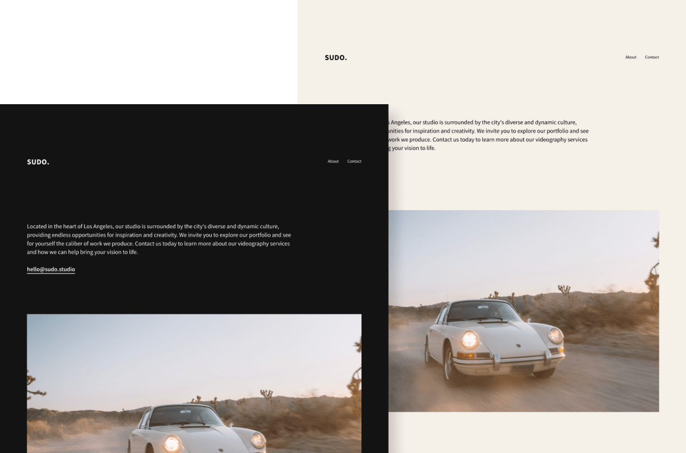

<p align="center">
  
</p>

<h1 align="center">Sudo</h1>
<p align="center">
  ✨ <span style="font-style: italic;">A minimalistic portfolio template for photographers, design studios and creative people</span> ✨
  <br/>
</p>
<h2>Highlights</h2>
<ul>
  <li>🚀 Next.js 14 (App Router)</li>
  <li>⚡️ Next Font & Next Image</li>
  <li>🖼️ TailwindCSS</li>
  <li>🌑 Light and dark mode</li>
</ul>
<h2>Running Locally</h2>

```bash
git clone git@github.com:marcbruederlin/sudo.git
cd sudo
bun install
bun dev
```

<h2>Credits</h2>
<p>The photos used in the design are from <a target="_blank" href="https://unsplash.com/de/@spencerdavis">Spencer Davis</a>.</p>
